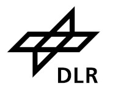

# Quantum Deep Reinforcement Learning for Robot Navigation Tasks

This is the training infrastructure for the Quantum Deep Reinforcement Learning with the DDQN
algorithm as presented in [1].

## Installation
First follow the installation instructions of the
[qturtle](https://github.com/dfki-ric-quantum/qdrl-turtlebot-env) environment and ensure it is
in your python path. Then install the dependencies via

```
pip install -r requirements.txt
```

## Usage

To start a training, execute the `run_training.py` script as such:
```
python run_training.py -n NUMBER -d DIR -c CONFIG
```
where

* `NUMBER` is a number to distinguish multiple parallel runs and is used as a reference in the
  generated output files.
* `DIR` is the absolute or relative path to a directory that should be used to write all outputs. If
  the directory does not exist, it will be created before the training starts.
* `CONFIG` is the name of a configuration for the training

Configurations need to be stored in `qeval/config`, several examples for the baseline OpenAI gym
environments as well as the turtlebot environment for both, classical baseline and parameterized
quantum circuits, are provided. For details on the training setup and environments, we refer to [1].

The configuration file has to be passed without path and without the `*.py` file ending to the `-c`
option e.g., if your configuration file is name `qeval/config/my_config.py`, only pass `my_config`.

After the training results are written to two files. First each training run creates a file in the
specified directory with the following file name pattern:
```
CONFIG_run_NUMBER_TIMESTAMP.pickle
```
where `CONFIG` is the name of the training configuration passed to the training script and `NUMBER`
the parameter passed with `-n`. This file contains a directory with the following content:

* `"time"`: time stamp of the end of the training
* `"n"`: the number passed with `-n`
* `"config"`: A copy of the training configuration
* `"rewards"`: History of the evaluation rewards during the training

Furthermore a line containing the number passed with `-n`, the training duration in steps and the
final evaluation reward to a file called `stats.txt`. This is useful, if several training are
started in parallel and are writing to the same output directory.

## License
Licensed under the BSD 3-clause license, see `LICENSE` for details.

## Acknowledgments
This work was funded by the German Federal Ministry of Economic Affairs and Climate Action (BMWK)
and German Aerospace Center e.V. (DLR e.V.) under project number 50RA2033 (DFKI) and 50RA2032
(University of Bremen) and was part of the project QINROS (Quantum Computing and Quantum Machine
Learning for Intelligent and Robotic Systems).

## References
* [1] Heimann, D., Hohenfeld, H., Wiebe, F., & Kirchner, F. (2022). *Quantum deep reinforcement learning for robot navigation tasks*. arXiv preprint [arXiv:2202.12180](https://arxiv.org/abs/2202.12180).

<a href="https://robotik.dfki-bremen.de/en/"></a>
<a href="https://www.uni-bremen.de/en/"></a>
<a href="https://www.bmwk.de/"></a>
<a href="https://www.dlr.de/"></a>

